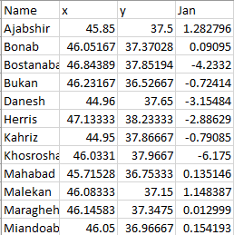
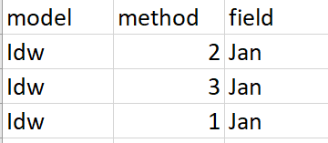
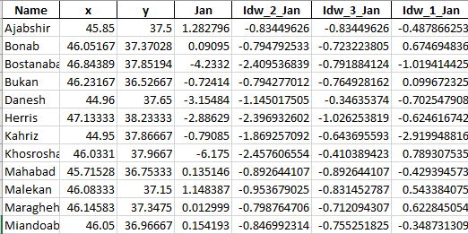
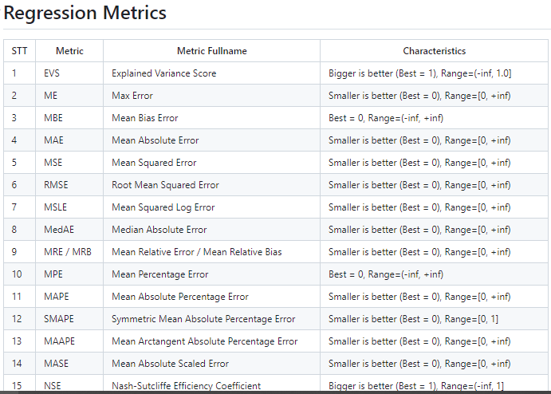

# Interpolation and Evaluation

## Table of Contents:
- [Objective](#objective)
- [Library Installation](#library-installation)
    - [Install pandas](#install-pandas)
    - [Install arcpy](#install-arcpy)
    - [Install geopandas](#install-geopandas)
    - [Install rasterio](#install-rasterio)
    - [Install permetrics](#install-permetrics)
- [Functions Used in Libraries](#functions-used-in-libraries)
    - [Pandas Functions](#pandas-functions)
    - [Arcpy Functions](#arcpy-functions)
    - [Geopandas Functions](#geopandas-functions)
    - [Rasterio Functions](#rasterio-functions)
    - [Permetrics Functions](#permetrics-functions)
- [Example](#example)
    - [Excel Data from YouTube](#excel-data-from-youtube)
    - [Variables](#variables)
    - [Output Images](#output-images)
    - [Evaluation Metrics](#evaluation-metrics)
- [Code Development](#code-development)
    - [Interpolation](#interpolation)
    - [Evaluation](#evaluation)
- [Contributing](#contributing)
- [Contact](#contact)

### Objective
The goal of this code is to find the best interpolation method for quantitative data and predict other areas in GIS. The selected methods will be evaluated using metrics such as RSME, R, MABE, MAPE, etc. For more details, click [here](https://youtu.be/0rBa5y5-4F0).

### Library Installation

#### Install Pandas
This library is installed by default and is recognized as **pd** in the code.

#### Install Arcpy
If ArcMap or ArcGIS Pro software is installed, **arcpy** is installed by default.

#### Install Geopandas
0. Install Anaconda.
1. Remove all environments cloned from Anaconda through the package manager of Anaconda or ArcGIS Pro.
2. Open the Conda prompt for ArcGIS from the following address:

   ***C:\Program Files\ArcGIS\Pro\bin\Python\Scripts\proenv.bat***
3. Clone from `arcgispro-py3` using the following command:

   `conda create --name gisenv --clone arcgispro-py3`

   Note: You can use any name instead of gisenv.
4. Activate the environment created in step 3 using the following command:

   `activate gisenv`
5. Install geopandas and its required packages using the following commands:

```
pip install geopandas 

pip install folium

pip install matplotlib 

pip install mapclassify
```

#### Install Rasterio
0. Install Anaconda.
1. Remove all environments cloned from Anaconda through the package manager of Anaconda or ArcGIS Pro.
2. Open the Conda prompt for ArcGIS from the following address:

 ***C:\Program Files\ArcGIS\Pro\bin\Python\Scripts\proenv.bat***

3. Clone from `arcgispro-py3` using the following command:

`conda create --name gisenv --clone arcgispro-py3`

Note: You can use any name instead of gisenv.

4. Activate the environment created in step 3 using the following command:

`activate gisenv`

5. Install rasterio using the following command:

```
pip install rasterio
```


#### Install Permetrics
0. Install Anaconda.
1. Remove all environments cloned from Anaconda through the package manager of Anaconda or ArcGIS Pro.
2. Open the Conda prompt for ArcGIS from the following address:

***C:\Program Files\ArcGIS\Pro\bin\Python\Scripts\proenv.bat***

3. Clone from `arcgispro-py3` using the following command:

`conda create --name gisenv --clone arcgispro-py3`

Note: You can use any name instead of gisenv.

4. Activate the environment created in step 3 using the following command:

`activate gisenv`

5. Install permetrics using the following commands:
```
git clone https://github.com/thieu1995/permetrics.git
cd permetrics
python setup.py install
```

### Functions Used in Libraries

#### Pandas Functions
[GitHub Pandas](https://github.com/pandas-dev/pandas)

[Website Pandas](https://pandas.pydata.org)

|Function Name|Input Parameters|Output Type|Link|
|----|----------|-------------|---------|
|read_excel|ExcelFile, Sheet Name|DataFrame|[Link](https://pandas.pydata.org/docs/reference/api/pandas.read_excel.html)|
|iterrows|None|Row in DataFrame|[Link](https://pandas.pydata.org/docs/reference/api/pandas.DataFrame.iterrows.html#pandas.DataFrame.iterrows)|
|drop|Labels, Axis|DataFrame or None|[Link](https://pandas.pydata.org/docs/reference/api/pandas.DataFrame.drop.html#pandas.DataFrame.drop)|
|at|Row, Column|Everything|[Link](https://pandas.pydata.org/docs/reference/api/pandas.DataFrame.at.html#pandas.DataFrame.at)|
|DataFrame|Data, Index|DataFrame|[Link](https://pandas.pydata.org/docs/reference/frame.html#dataframe)|
|columns|Origin, Destination|Object|[Link](https://pandas.pydata.org/docs/reference/api/pandas.DataFrame.columns.html#pandas.DataFrame.columns)|
|rename|Dictionary|DataFrame|[Link](https://pandas.pydata.org/docs/reference/api/pandas.DataFrame.rename.html#pandas.DataFrame.rename)|
|merge|DataFrame, On, How|DataFrame|[Link](https://pandas.pydata.org/docs/reference/api/pandas.DataFrame.merge.html#pandas.DataFrame.merge)|
|to_excel|ExcelFile, Index|Excel|[Link](https://pandas.pydata.org/docs/reference/api/pandas.DataFrame.to_excel.html#pandas.DataFrame.to_excel)|

#### Arcpy Functions
[GitHub Arcpy](https://github.com/arcpy)

[Website Arcpy](https://pro.arcgis.com/en/pro-app/latest/tool-reference)

|Function Name|Input Parameters|Output Type|Link|
|----|----------|-------------|---------|
|sa.Idw|Shapefile or Feature Class, Z_Field, Method, Cell_Size|Raster|[Link](https://pro.arcgis.com/en/pro-app/latest/tool-reference/spatial-analyst/idw.htm)|
|sa.Kriging|Shapefile or Feature Class, Z_Field, Method, Cell_Size|Raster|[Link](https://pro.arcgis.com/en/pro-app/3.1/tool-reference/spatial-analyst/kriging.htm)|
|sa.Spline|Shapefile or Feature Class, Z_Field, Method, Cell_Size|Raster|[Link](https://pro.arcgis.com/en/pro-app/3.1/tool-reference/spatial-analyst/spline.htm)|

#### Geopandas Functions
[GitHub Geopandas](https://github.com/geopandas)

[Website Geopandas](https://geopandas.org/en/stable/)

|Function Name|Input Parameters|Output Type|Link|
|----|----------|-------------|---------|
|GeoDataFrame|Data, Geometry|GeoDataFrame|[Link](https://geopandas.org/en/stable/docs/reference/api/geopandas.GeoDataFrame.html#geopandas.GeoDataFrame)|
|points_from_xy|Longitude, Latitude|Point|[Link](https://geopandas.org/en/stable/gallery/create_geopandas_from_pandas.html)|
|set_crs|EPSG, Inplace|Int|[Link](https://geopandas.org/en/stable/docs/reference/api/geopandas.GeoDataFrame.set_crs.html)|
|to_file|Filename, Driver, Encoding|Everything|[Link](https://geopandas.org/en/stable/docs/reference/api/geopandas.GeoDataFrame.to_file.html#geopandas.GeoDataFrame.to_file)|

#### Rasterio Functions
[GitHub Rasterio](https://github.com/rasterio)

[Website Rasterio](https://rasterio.readthedocs.io/en/stable/)

|Function Name|Input Parameters|Output Type|Link|
|----|----------|-------------|---------|
|open|Raster|File|[Link](https://rasterio.readthedocs.io/en/stable/quickstart.html#opening-a-dataset-in-reading-mode)|
|index|Longitude, Latitude|Tuple|[Link](https://rasterio.readthedocs.io/en/stable/quickstart.html#spatial-indexing)|
|read|1, Window|Array|[Link](https://rasterio.readthedocs.io/en/stable/topics/reading.html)|

#### Permetrics Functions
[GitHub Permetrics](https://github.com/thieu1995/permetrics)

[Website Permetrics](https://permetrics.readthedocs.io/)

|Function Name|Input Parameters|Output Type|Link|
|----|----------|-------------|---------|
|RegressionMetric|Y_true, Y_pred|RegressionMetric|[Link](https://permetrics.readthedocs.io/en/latest/pages/regression.html)|
|mean_bias_error|None|Double|[Link](https://permetrics.readthedocs.io/en/latest/pages/regression/MBE.html)|
|root_mean_squared_error|None|Double|[Link](https://permetrics.readthedocs.io/en/latest/pages/regression/RMSE.html)|
|mean_percentage_error|None|Double|[Link](https://permetrics.readthedocs.io/en/latest/pages/regression/MPE.html)|
|pearson_correlation_coefficient|None|Double|[Link](https://permetrics.readthedocs.io/en/latest/pages/regression/R.html)|

### Example

#### Excel Data from YouTube
The table below is based on the YouTube video.

The file is sample.xlsx.



This file is model.xlsx.



#### Variables
 **workspace**: The address where the interpolation.gdb file should be created.

 **address_input**: The address of the sample Excel file.

 **zone**: The study zone, which is between 38 and 41 for Iran.

 **raster_address**: By default, it is C:\temp.tif. If it gives an error, change the image address, and it will work correctly.

 **address_model**: The address of the model Excel file.

 **program**: Continue the program or not.

Column 2 should be **x**, and column 3 should be **y**.

 **field**: Reads from the model Excel.

 **final_Excel**: Asks for the final Excel address.

 **start_column**: Stores the column number of methods, which is 4 by default.

 **evaluate_Excel**: Asks for the evaluation Excel address.

#### Output Images

Final Excel:



Evaluation Excel:


#### Evaluation Metrics

[Evaluation Methods](https://permetrics.readthedocs.io/en/latest/pages/regression.html)



The variables are as follows:


### Code Development

#### Interpolation
[Other Interpolation Methods](https://pro.arcgis.com/en/pro-app/3.0/tool-reference/spatial-analyst/an-overview-of-the-interpolation-tools.htm)


```python
if interpolation_type == "Idw":
 out_raster = arcpy.sa.Idw(temp_address, field, method)       
elif interpolation_type == "Kriging":
 out_raster = arcpy.sa.Kriging(temp_address, method, field)
elif interpolation_type == "Spline":
 out_raster = arcpy.sa.Spline(temp_address, field, spline_type=method)
else:
 return None
```
#### Evaluation

[Other Evaluation Methods](https://permetrics.readthedocs.io/en/latest/pages/regression.html)

```py
if method == "MBE":
    res = evaluator.mean_bias_error()
    res_dict[i] = [col, res]  
elif method == "RMSE":
    res = evaluator.root_mean_squared_error()
    res_dict[i] = [col, res]
elif method == "MAPE":
    res = evaluator.mean_percentage_error()
    res_dict[i] = [col, res]
elif method == "R":
    res = evaluator.pearson_correlation_coefficient()
    res_dict[i] = [col, res]
else:
    return None
```
### Contributing

1. Fork the repository.

2. Create a new branch:`git checkout -b feature-newfeature`.

4. Commit changes: `git commit -m 'Add new feature'`.
5. Push to the branch: `git push origin feature-newfeature`.

6. Submit a pull request.

### Contact

- Email: taherpoor@ut.ac.ir
- Telegram : mttaherpoor
